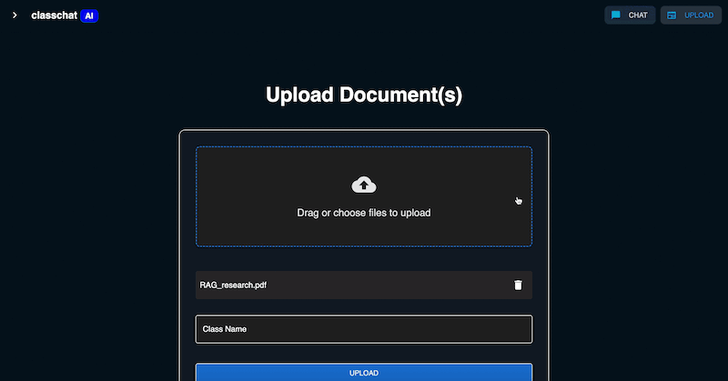

# Class Chat AI 📚💬  
*AI-powered study tool that turns your class documents into reliable, cited answers.*

---

## Why use Class Chat?  
- **All your sources, one chatbot.** Ask questions across lecture notes, textbooks, and slides.  
- **Trust every answer.** Inline citations plus full-file references show exactly *where* the fact came from.  
- **Study faster.** Average response < 3 s thanks to adaptive chunking and caching.  
- **Privacy first.** Documents stay encrypted at rest in your personal workspace—never shared or sold.

---

## Steps — How Class Chat works in practice

| Step | What happens | Demo |
|------|--------------|------|
| **1. Upload documents** | Drag-and-drop PDFs or notes, then group them into *classes* for easy context switching. |  |
| **2. Chat with a class** | Ask anything about an entire course; Class Chat retrieves relevant chunks across all docs and returns answers with inline citations plus a sidebar of full references. |  |
| **3. Chat with a document (side-by-side)** | Focus on a single file; when you click a citation, the viewer jumps to the exact page so you can verify instantly. |  |

---

## Under the Hood

| Layer | Tech |
|-------|------|
| Frontend | React + Vite + Material-UI |
| Realtime | WebSockets for streaming responses |
| Backend (API) | Node.js / Express (auth, REST) |
| AI Service | Python FastAPI · LangChain RAG chain · OpenAI GPT-4o |
| Vector Store | MongoDB Atlas Vector Search |
| Storage & Infra | AWS S3 (documents) · Vercel (frontend) · Heroku (Node & FastAPI) |

---

## Built With

  
  
  
  
  
  

---

## Quick Links

- **Live site:** <https://app.classchatai.com>  

